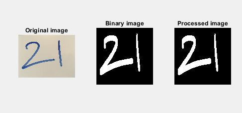
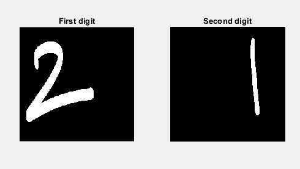
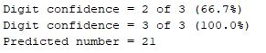

# Numeral-Classification
This was for the Advanced Machine Vision module. 

-----------------------------------------------------------------------------------------------------
#### TO DO:
#### Clean up the folders and code to make it a bit easier to follow.
------------------------------------------------------------------------------------------------------

Classification of Handwritten Numerals Through the Exploration of a k-Nearest Neighbours Classifier and a Supervised Learning Convolutional Neural Network.

The first stage of this assignment was to build a KNN to classify handwritten numerals:

Using a test image of the number 21:

The algorithm first converts the image to binary before using morphological operations to process the image.

Then it is possible to identify and separate multiple digits within a number. 

The digits can now be classified

The Second half of this project focused on transfer learning and using AlexNet to classify handwritten numerals.
